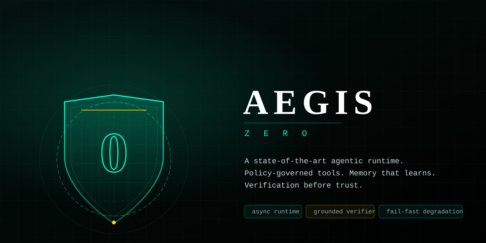
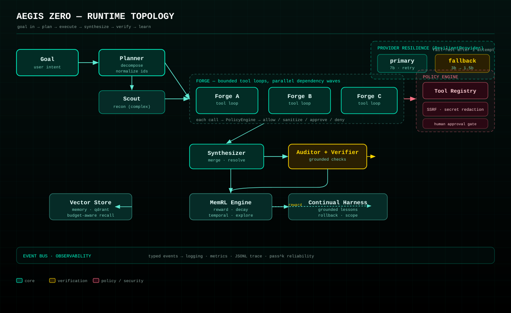

<p align="center">
  
</p>

<p align="center">
  <b>A state-of-the-art agentic runtime.</b><br>
  Async orchestration · policy-governed tools · reinforcement-weighted memory · grounded verification.
</p>

<p align="center">
  <a href="https://github.com/khalidhassan01/Aegis-Zero/actions/workflows/ci.yml"></a>
  <a href="https://www.python.org/"></a>
  <a href="LICENSE"></a>
  
</p>

---

Most agent frameworks give you a prompt loop and hope for the best. **Aegis Zero**
is built around three commitments, each enforced in code rather than promised
in prose:

1. **Nothing executes unreviewed.** Every tool call passes a policy engine that
   classifies risk, blocks SSRF and destructive commands, contains filesystem
   access, redacts secrets, and routes high-risk actions to a human.
2. **Memory learns — and is held to the truth.** Retrieved memories are scored by
   whether they actually helped. Useful recollections surface more often;
   misleading ones decay and are tombstoned when a verifier proves them false.
3. **Failures are typed, never swallowed.** Every error is a specific exception
   with structured context. Budgets are hard limits, not suggestions. And the
   auditor is **grounded in external checks**, because intrinsic self-correction
   is known not to work (Huang et al., ICLR 2024).

<p align="center">
  
</p>

## Why Aegis Zero is different

This project treats its own claims as hypotheses to be falsified. The
[architecture audit](docs/AUDIT.md) reproduced every defect with an executable
probe before fixing it, and the [roadmap](docs/ROADMAP.md) cites peer-reviewed
sources for every recommendation — and corrects two research claims that did not
hold up under measurement. What follows is what that discipline produced.

| | Aegis Zero | Typical agent loop |
|---|---|---|
| Tool execution | policy-gated: allow / sanitize / approve / deny | a single `try/except` |
| Context budget | enforced per *model* (P5) | one global constant |
| Self-correction | verifier-forced revisions, not introspection | "review your own answer" |
| Resilience | retries + fail-fast model degradation | hope the API stays up |
| Memory | reinforcement-weighted, temporal, explorative | append-only vector store |
| Reliability | `pass^k` reported with a confidence interval (P4) | "it worked once" |

## Install

```bash
pip install -e ".[dev]"          # from a clone
pip install -e ".[qdrant]"       # with the Qdrant memory backend
```

Requires Python 3.11+. Runtime dependencies are just `httpx` and `PyYAML`.

## Quick start

```python
import asyncio
from aegis_zero import build_agent
from aegis_zero.tools import ConsoleGate

async def main():
    async with build_agent(approval=ConsoleGate()) as agent:
        result = await agent.ask("What is 2^16, and why does it matter?")
        print(result.answer)
        print(result.summary())

asyncio.run(main())
```

From the command line:

```bash
aegis run "Summarise the CAP theorem"     # run a goal
aegis run "..." --stats -v                # with metrics and live events
aegis reliability "..." -n 5 -k 3         # run N times; report pass^k
aegis tools                               # list tools + policy verdicts
aegis config                              # show effective configuration
aegis health                              # check provider and memory
```

## Architecture

```
                        ┌─────────────┐
   goal ───────────────>│   Planner   │  decompose into subtasks
                        └──────┬──────┘
                               │
                        ┌──────▼──────┐
                        │    Scout    │  reconnaissance (complex goals only)
                        └──────┬──────┘
                               │
              ┌────────────────┼────────────────┐   parallel dependency waves
        ┌─────▼─────┐    ┌─────▼─────┐    ┌─────▼─────┐
        │   Forge   │    │   Forge   │    │   Forge   │  bounded tool loops
        └─────┬─────┘    └─────┬─────┘    └─────┬─────┘
              └────────────────┼────────────────┘
                        ┌──────▼──────┐
                        │ Synthesizer │  merge, resolve conflicts
                        └──────┬──────┘
                               │
                        ┌──────▼──────┐
                        │  Auditor +  │  grounded verification ──┐
                        │  Verifier   │                          │ revise
                        └──────┬──────┘                          │
                               │  pass                          │
                        ┌──────▼──────┐                         │
                        │   MemRL     │<────────────────────────┘
                        └─────────────┘  reward what helped
```

Every tool call in every Forge loop is intercepted by the `PolicyEngine`
before it ever touches a model or a system:

```
tool call ──> PolicyEngine ──> allow ──────────────> execute
                    │
                    ├────────> sanitize ──────────> execute (redacted args)
                    ├────────> approve ──> human ─> execute or refuse
                    └────────> deny ──────────────> error returned to model
```

### Package layout

```
src/aegis_zero/
├── core/            models, typed errors, layered config, event bus
├── providers/       async LLM abstraction, OpenAI-compat, retry + fail-fast fallback
├── tools/           registry with derived schemas, policy engine, approvals
├── memory/          vector stores, MemRL reinforcement retrieval, Continual Harness
├── orchestrator/    planning, context assembly, the agent engine, reliability
├── observability/   structured logging, metrics, JSONL tracing
├── app.py           composition root
└── cli.py           command-line interface
```

## Core concepts

### Tools are typed functions

Schemas are derived from signatures, so the contract can't drift from the code.

```python
from aegis_zero.core.models import Risk
from aegis_zero.tools import default_registry

registry = default_registry()

@registry.tool(risk=Risk.MEDIUM)
async def query_database(sql: str, limit: int = 100) -> list[dict]:
    """Run a read-only query against the application database."""
    return await db.fetch(sql, limit)
```

### Policy is declarative and enforced

```python
from aegis_zero.tools import PolicyEngine

policy = PolicyEngine(
    approval_threshold="high",       # high and critical need a human
    allowed_roots=("/srv/workspace",),  # filesystem containment
    denied_tools=("shell",),
    allow_network=True,
)
```

Blocked by default: private/loopback/metadata addresses after DNS resolution,
non-HTTP schemes, `/etc/shadow` and friends, `.ssh` and `.gnupg`, symlink and
traversal escapes from allowed roots, and a broad set of destructive shell
patterns. Secret-looking keys and values are redacted before a tool ever sees
them — and before anything reaches a log or trace.

> The SSRF defences hold against every probe we threw at them (decimal, hex,
> octal, IPv6, trailing-dot DNS). The command denylist does **not** — a shell
> has unbounded ways to express the same command. See [SECURITY_MODEL.md](docs/SECURITY_MODEL.md)
> for the honest accounting and the containment-based fix.

### Memory that learns

```python
result = await agent.ask("How do I deploy the service?")
# Memories used in a successful, confidently-audited run get rewarded.
# Memories that were retrieved but never helped decay and are eventually pruned.

await agent.memory.consolidate()   # nightly maintenance
await agent.memory.health()        # {'count': ..., 'hit_rate': ..., ...}
```

Ranking blends similarity, learned utility, and recency:

```
rank = 0.60 * similarity + 0.30 * utility + 0.10 * recency
```

An exploration bonus (UCB1-style) keeps a lucky winner from starving better
alternatives, and a temporal-validity gate deprecates facts that have gone
stale or been contradicted.

### Budgets are enforced

```python
from aegis_zero.core.models import Budget

result = await agent.ask(goal, budget=Budget(
    max_steps=12, max_tokens=50_000, max_seconds=120, max_tool_calls=20,
))
```

Exceeding any limit raises `BudgetExceeded`, which the engine converts into a
failed-but-reported result rather than an unbounded spend.

The prompt budget is derived **per model**: each model in
`ModelSettings.context_windows` has its own context window, and the prompt is
trimmed to that window minus a generation reserve. A model not in the registry
falls back to a conservative default, so a 1.5b and a 32k-window model are no
longer forced to share one global number.

### Reliability is measured, not claimed

An agent that passes once can still be unreliable. `reliability()` runs a goal
`n` times and reports `pass@k` — the probability it succeeds `k` times in a row
— with a 95% Wilson interval and the mean tokens/seconds/revisions per run, so
an "improvement" that is really just more compute is visible:

```python
report = await agent.reliability("Deploy the service", n=5, k=3)
print(report.summary())
# {'n': 5, 'k': 3, 'pass@1': 1.0, 'pass@3': 1.0,
#  'pass@k_lower': 0.23, 'pass@k_upper': 1.0, ...}
```

### Observability

```python
agent.bus.subscribe(lambda e: print(e.type.value, e.data))
print(agent.metrics.snapshot())
# {'runs': 3, 'llm_calls': 14, 'tool_calls': 6, 'tool_failures': 0,
#  'policy_denials': 1, 'tokens': 8420, 'latency_p95_ms': 812.4, ...}
```

Set `trace_dir` in config to write a JSONL trace of every event.

## Configuration

Defaults < YAML file < environment. Environment always wins.

```bash
export AEGIS_PROVIDER__BASE_URL=http://127.0.0.1:11434/v1
export AEGIS_MODELS__FAST=qwen2.5:7b
export AEGIS_POLICY__APPROVAL_THRESHOLD=medium
export AEGIS_MAX_STEPS=12
```

Any OpenAI-compatible endpoint works: OpenAI, Ollama's `/v1` shim, vLLM,
LiteLLM, or a local router. If the primary model OOMs or errors, the provider
degrades to a smaller fallback after a single attempt instead of failing.

See [`aegis.example.yaml`](aegis.example.yaml) for every option.

## Testing without a model

`EchoProvider` returns scripted completions, so orchestration logic is testable
offline and deterministically:

```python
from aegis_zero.providers import EchoProvider, scripted_tool_call

provider = EchoProvider(script=[
    scripted_tool_call("calculate", {"expression": "6*7"}),
    "The answer is 42.",
    '{"verdict":"pass","confidence":0.95,"issues":[]}',
])
```

See [`examples/offline_testing.py`](examples/offline_testing.py).

## What we have proven — and what we have not

We hold ourselves to the bar in the roadmap's measurement section: a fixed
held-out set, fixed seeds, `pass^k` alongside `pass@1`, and an honest baseline.
That discipline produced these shipped, test-backed improvements:

- **Grounded verifier (P1).** The auditor is forced by deterministic external
  checks (schema, execution, arithmetic, citation, tool-consistency), not by the
  model grading its own answer.
- **Per-model context windows (P5, audit #13).** Prompt budget derived per model.
- **pass^k reliability (P4, τ-bench).** `Aegis.reliability()` with a Wilson interval.
- **Fail-fast model degradation.** `ResilientProvider` drops to a smaller model
  after one failed primary attempt.
- **Temporal memory validity (P6.5).** Stale and contradicted facts are
  tombstoned, not deleted.
- **Winner-take-all retrieval fixed.** A UCB1 exploration bonus breaks the
  popularity spiral.

We have **not** solved — and say so plainly:
- **Coarse memory credit assignment (P6).** Still open; every memory in a
  successful run is rewarded, including irrelevant ones.
- **The command denylist.** Documented as not a security boundary; containment
  is the honest fix.
- **Self-modifying agents, multi-agent debate-by-default, tree search in the
  main loop.** Deliberately omitted, with the evidence in the roadmap.

## Development

```bash
pytest --cov              # 290+ tests
ruff check src tests      # lint
mypy                      # type check
```

CI runs lint, mypy, tests on Python 3.11/3.12/3.13, a coverage floor, a
distribution build, an installed-CLI smoke test, and CodeQL.

## Migrating from v1

v1 modules are preserved under [`legacy/`](legacy/) for reference. The mapping:

| v1 | v2 |
|---|---|
| `puppeteer.Puppeteer` | `orchestrator.AgentEngine` |
| `agent_harness.HardenedPuppeteer` | `app.build_agent()` |
| `tool_policy.ToolPolicy` | `tools.PolicyEngine` |
| `memrl_engine.MemRLEngine` | `memory.MemRLEngine` (async) |
| `context_engine.ContextEngine` | `orchestrator.ContextBuilder` |
| `aegis_config.get_*()` | `core.config.load_settings()` |
| direct `ollama` calls | `providers.OpenAICompatProvider` |

The principal change is that everything is `async`, and subtasks that don't
depend on each other now run concurrently.

## Documentation

- [Architecture audit](docs/AUDIT.md) — defects reproduced before fixing
- [Roadmap](docs/ROADMAP.md) — evidence-graded improvements, what we did and why
- [Security model](docs/SECURITY_MODEL.md) — what is and isn't a boundary
- [Integration guide](docs/AEGIS_INTEGRATION_GUIDE.md)
- [Research foundation](docs/AEGIS_ZERO_RESEARCH_FOUNDATION.md)

## License

MIT — see [LICENSE](LICENSE).
